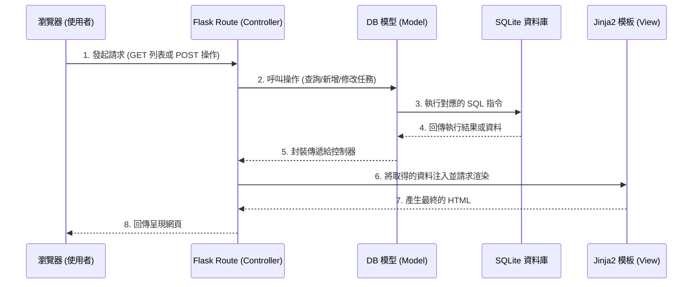

# 任務管理系統 - 系統架構文件

## 1. 技術架構說明

本專案採用輕量級的 Web 開發架構，選用以下技術：

- **後端框架**：Python + Flask
  - **原因**：Flask 是一個輕量且彈性的 Python Web 框架，非常適合用於開發中小型應用程式或快速建立 MVP 原型。
- **模板引擎**：Jinja2
  - **原因**：內建於 Flask 中，能夠將後端傳遞的資料動態渲染到 HTML 頁面上，無需額外配置複雜的前端框架，實作非前後端分離的經典 MVC 架構。
- **資料庫**：SQLite
  - **原因**：無須額外安裝資料庫伺服器，資料儲存於單一檔案中，開發與部署都極為方便，非常適合此專案的輕型需求。

### Flask MVC 模式說明
- **Model (模型)**：負責定義資料結構與資料庫溝通的核心邏輯。在此專案中就是對應任務 (Task) 的屬性與資料表操作。
- **View (視圖)**：負責將資料呈現給使用者。由 HTML 檔案結合 Jinja2 模板標籤構成，渲染出最終的網頁介面。
- **Controller (控制器)**：由 Flask 的路由 (Routes) 擔任，負責接收使用者的請求 (Request)，向 Model 存取或更新資料，然後將結果交由 View 渲染成完整的網頁回應 (Response)。

## 2. 專案資料夾結構

以下為本專案的資料夾與檔案結構配置：

```text
web_app_development/
├── app/
│   ├── __init__.py      # Flask 應用程式初始化
│   ├── models.py        # 資料庫模型結構定義 (Model)
│   ├── routes.py        # 應用程式路由處理邏輯 (Controller)
│   ├── templates/       # HTML 模板檔案 (View)
│   │   ├── base.html    # 全域共用頁面版型
│   │   └── index.html   # 首頁/任務列表與操作頁面
│   └── static/          # CSS / JS 等靜態資源
│       ├── css/
│       │   └── style.css # 前端樣式設計檔
│       └── js/
│           └── script.js # 前端輔助互動腳本
├── instance/
│   └── database.db      # SQLite 資料庫檔案
├── docs/                # 專案文件 (包含 PRD, ARCHITECTURE 等)
├── app.py               # 專案啟動入口點
└── requirements.txt     # Python 依賴包清單
```

## 3. 元件關係圖

以下展示了系統核心元件之間的互動流程：



## 4. 關鍵設計決策

1. **採用非前後端分離架構**
   - **原因**：任務管理系統的功能相對直觀單純，採用 Flask + Jinja2 一起渲染能大幅簡化開發流程、降低系統複雜度。未來若有需要也能輕易抽出 API 轉型。
2. **單一且集中的頁面體驗 (Single Page Focus)**
   - **原因**：為了提升使用者的操作流暢並符合 PRD 的需求，任務列表、新增、完成狀態切換等行為盡可能整合為單一主要畫面。當使用者送出表單後，伺服器處理完即重導向 (Redirect) 回首頁，更新目前狀態。
3. **資料庫置於 `instance/` 目錄**
   - **原因**：Flask 的標準實踐，便於管理並且能透過 `.gitignore` 排除真實的資料庫檔案，維持版本控制環境的乾淨與資料安全。
