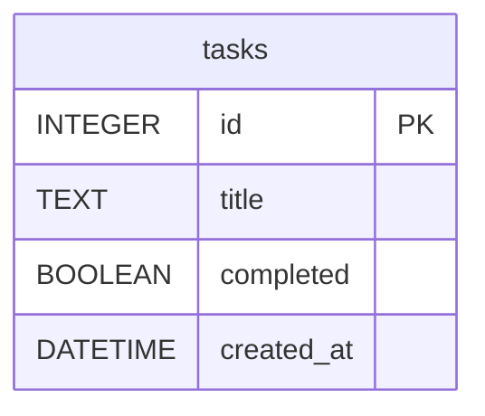

# 任務管理系統 - 資料庫設計文件 (DB Design)

## 1. ER 圖（實體關係圖）

目前系統在 MVP 階段主要針對單一使用者的待辦事項進行管理，因此僅包含 `tasks` 資料表：



## 2. 資料表詳細說明

### `tasks` (任務表)

負責儲存使用者的所有待辦任務紀錄。

| 欄位名稱 | 型別 | 必填 | 預設值 | 說明 |
| --- | --- | --- | --- | --- |
| `id` | INTEGER | 是 | 自動遞增 | Primary Key，任務的唯一識別碼。 |
| `title` | TEXT | 是 | 無 | 任務的名稱/內容。 |
| `completed` | BOOLEAN | 是 | 0 (False) | 任務的完成狀態。SQLite 中用整數 `0` 表未完成，`1` 表完成。 |
| `created_at` | DATETIME | 是 | CURRENT_TIMESTAMP | 任務的建立時間。 |

## 3. SQL 建表語法

請參考專案中的 `database/schema.sql`，以下為建立 `tasks` 資料表的語法：

```sql
CREATE TABLE IF NOT EXISTS tasks (
    id INTEGER PRIMARY KEY AUTOINCREMENT,
    title TEXT NOT NULL,
    completed BOOLEAN NOT NULL DEFAULT 0,
    created_at DATETIME DEFAULT CURRENT_TIMESTAMP
);
```

## 4. Python Model 程式碼

我們採用 Python 內建的 `sqlite3` 提供基本的 CRUD 封裝。相關實作請參考 `app/models/task.py` 中的 `TaskModel` 類別，它提供了下列方法：
- `create(title)`：新增任務
- `get_all()`：取得所有任務清單
- `get_by_id(task_id)`：取得單一任務
- `update(task_id, title=None, completed=None)`：修改任務標題或完成狀態
- `delete(task_id)`：刪除任務
