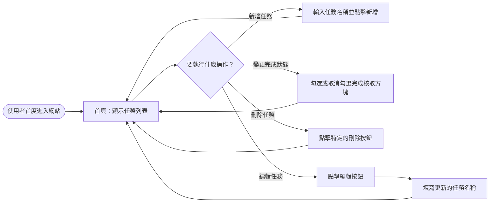
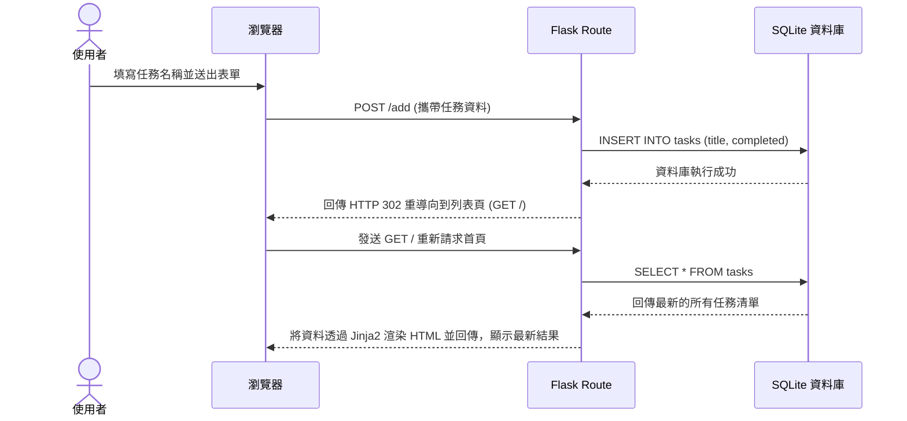

# 任務管理系統 - 流程圖文件

## 1. 使用者流程圖（User Flow）

以下圖表展示了使用者進入任務管理系統後的各種可能操作路徑與流程，主要強調於單一頁面上的流暢體驗：

## 2. 系統序列圖（Sequence Diagram）

以下圖表描述了當使用者執行「新增任務」操作時，系統各個元件（包含前端、後端路由與資料庫）如何互相溝通與傳遞資料的完整流程：

## 3. 功能清單對照表

根據 PRD 定義的主要功能，下表列出系統所需要的請求端點以及對應的 HTTP 方法規劃：

| 功能敘述 | URL 路徑 (Route) | HTTP 方法 | 附帶參數 / 資料需求 | 執行後果 |
| :--- | :--- | :--- | :--- | :--- |
| **顯示所有任務清單** | `/` | GET | 無 | 回傳並渲染 `index.html` 視圖 |
| **新增任務** | `/add` | POST | 表單資料傳遞任務標題 (`title`) | 寫入資料庫後重導向至 `/` |
| **標記任務完成/未完成**| `/toggle/<int:task_id>` | POST | URL 變數包含欲操作的任務 ID | 更新資料後重導向至 `/` |
| **刪除不需要的任務** | `/delete/<int:task_id>` | POST | URL 變數包含欲刪除的任務 ID | 刪除資料後重導向至 `/` |
| **編輯任務內容擷取** | `/edit/<int:task_id>` | GET | URL 變數包含欲編輯的任務 ID | 渲染包含舊資料的編輯表單或頁面 |
| **送出編輯任務** | `/edit/<int:task_id>` | POST | 表單資料傳遞新標題 (`new_title`) | 更新資料庫後重導向至 `/` |
